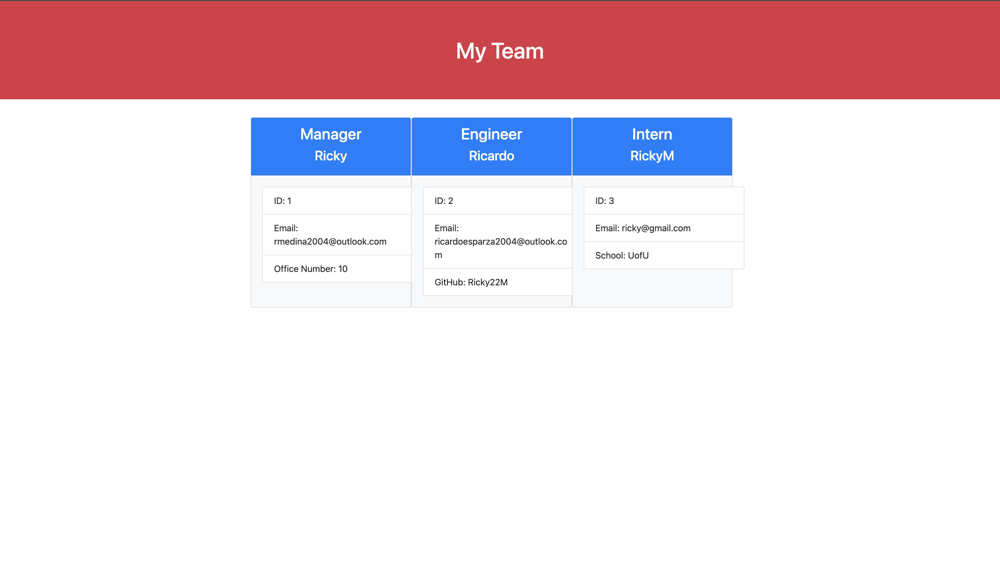

# Team-Profile-Generator

Need help building a workforce team profile webpage? Well as you use this Team Profile Generator app to build a webpage for your team, you'll find out that building your page is easy as answering a few questions.



## How It Works

By running the code within node (in the terminal run the command '`node index.js`'), the user will be prompted with questions such as the position of the employee (are they an intern, an engineer, or a manager?), basic information about the employee, (what's their name, ID number, email, etc.), and when the user is finished with building their team they have the option to end their team build proccess. Once the user ends their session of team building, a HTML page will be newly created, and is based off of the user input. When opening the HTML page, you are presented to a page titled "Team Profile Generator", a header with the words "My Team", and cards created based off of the user input.

## User Story

```md
AS A manager
I WANT to generate a webpage that displays my team's basic info
SO THAT I have quick access to their emails and GitHub profiles
```

## Acceptance Criteria

```md
GIVEN a command-line application that accepts user input
WHEN I am prompted for my team members and their information
THEN an HTML file is generated that displays a nicely formatted team roster based on user input
WHEN I click on an email address in the HTML
THEN my default email program opens and populates the TO field of the email with the address
WHEN I click on the GitHub username
THEN that GitHub profile opens in a new tab
WHEN I start the application
THEN I am prompted to enter the team manager’s name, employee ID, email address, and office number
WHEN I enter the team manager’s name, employee ID, email address, and office number
THEN I am presented with a menu with the option to add an engineer or an intern or to finish building my team
WHEN I select the engineer option
THEN I am prompted to enter the engineer’s name, ID, email, and GitHub username, and I am taken back to the menu
WHEN I select the intern option
THEN I am prompted to enter the intern’s name, ID, email, and school, and I am taken back to the menu
WHEN I decide to finish building my team
THEN I exit the application, and the HTML is generated
```

## Walkthrough Video

[Walkthrough video of Team Profile Generator](https://drive.google.com/file/d/1VzoShCNrLwG-cX-gSZFa0xkC-tFZZMU2/view?usp=share_link)